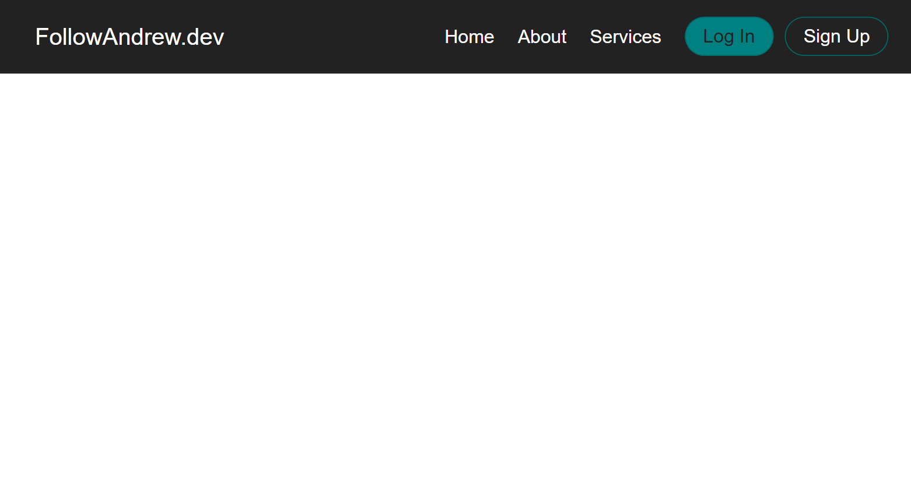

# Responisve navigation bar

This project is a simple demonstration of a responsive navigation bar for a website. The navigation bar adapts to different screen sizes, ensuring a user-friendly experience on both desktop and mobile devices.

## Features

- Responsive design: The navigation bar smoothly adjusts for various screen sizes, making it mobile-friendly.
- Clean and modern layout: The navigation bar offers an attractive and user-friendly interface.
- Easily customizable: You can customize the navigation links and styles to fit your specific project needs.

## Preview

### mobile

### tablet

### desktop

